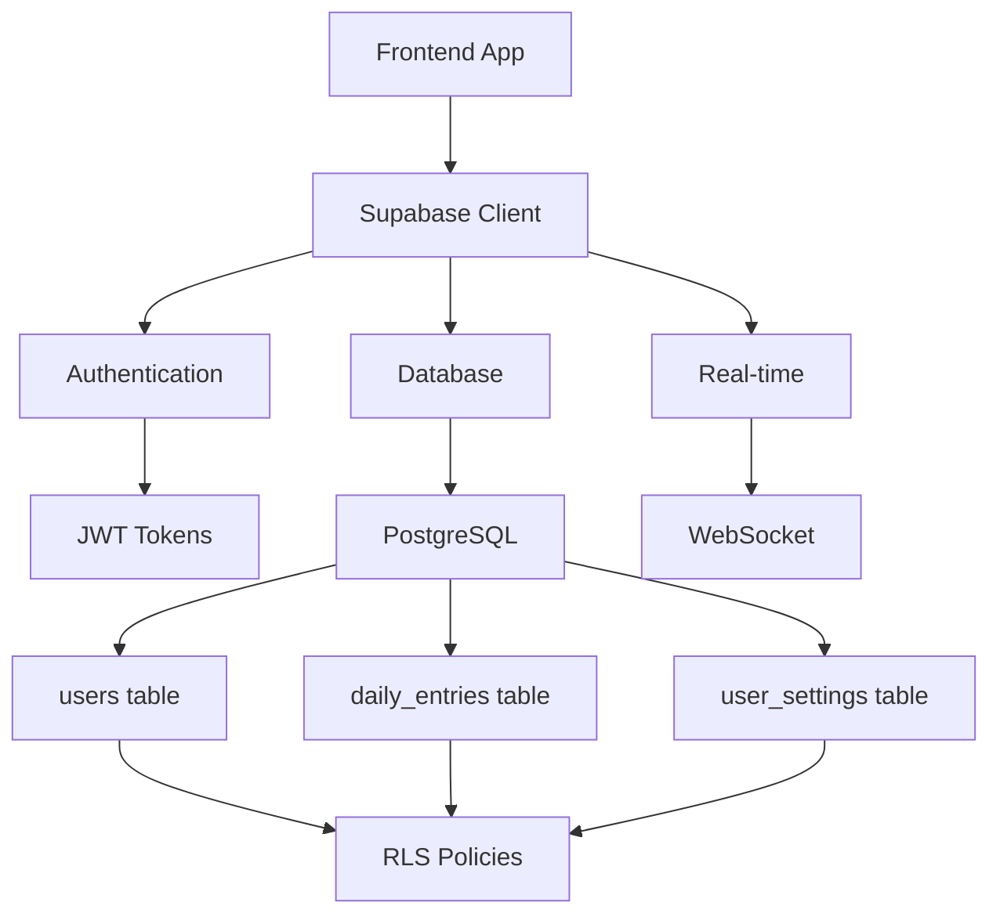
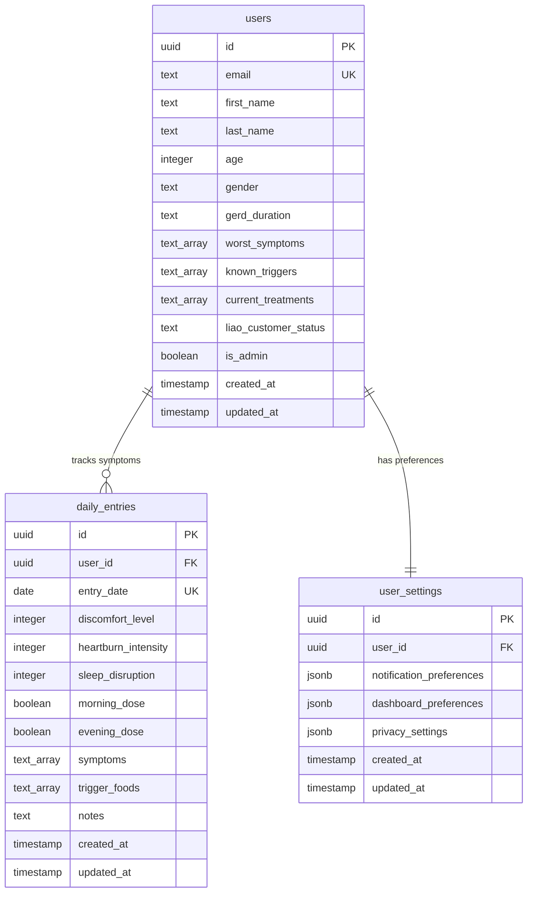
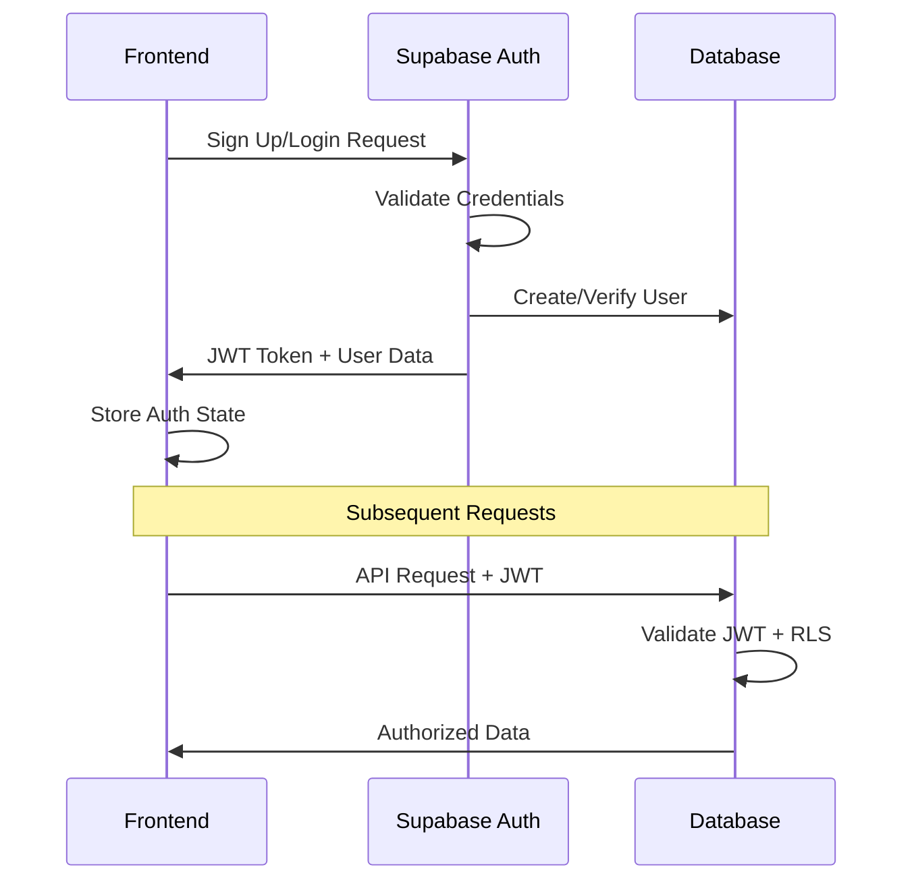

# OhMyGerd Backend Specification Document

## Executive Summary

This document provides comprehensive backend requirements for the OhMyGerd GERD tracking Progressive Web Application. The frontend is built with Next.js 15 and requires a robust Supabase PostgreSQL backend with authentication, real-time capabilities, and analytics support.

## Table of Contents

1. [System Architecture](#system-architecture)
2. [Database Schema](#database-schema)
3. [Authentication & Authorization](#authentication--authorization)
4. [API Endpoints](#api-endpoints)
5. [Business Logic & Formulas](#business-logic--formulas)
6. [KPIs & Analytics](#kpis--analytics)
7. [Security Requirements](#security-requirements)
8. [Performance Requirements](#performance-requirements)
9. [Integration Requirements](#integration-requirements)

---

## System Architecture

### Tech Stack Requirements
- **Database**: PostgreSQL 15+ (Supabase)
- **Authentication**: Supabase Auth with JWT
- **Real-time**: WebSocket connections via Supabase Realtime
- **Security**: Row Level Security (RLS) policies
- **Environment**: Node.js compatible with Next.js 15

### Core Data Flow



---

## Database Schema

### 1. Users Table

**Purpose**: Store user profiles and health assessment data

```sql
CREATE TABLE users (
    id UUID PRIMARY KEY DEFAULT uuid_generate_v4(),
    email TEXT UNIQUE NOT NULL,
    first_name TEXT,
    last_name TEXT,
    age INTEGER CHECK (age >= 18 AND age <= 120),
    gender TEXT CHECK (gender IN ('male', 'female', 'other', 'prefer_not_to_say')),
    
    -- Health Assessment Data
    gerd_duration TEXT CHECK (gerd_duration IN ('less_than_1_year', '1_3_years', '3_5_years', 'more_than_5_years')),
    worst_symptoms TEXT[] DEFAULT '{}',
    known_triggers TEXT[] DEFAULT '{}',
    current_treatments TEXT[] DEFAULT '{}',
    liao_customer_status TEXT CHECK (liao_customer_status IN ('new', 'existing', 'interested')) DEFAULT 'new',
    
    -- System Fields
    is_admin BOOLEAN DEFAULT FALSE,
    created_at TIMESTAMP WITH TIME ZONE DEFAULT NOW(),
    updated_at TIMESTAMP WITH TIME ZONE DEFAULT NOW()
);
```

**Business Rules**:
- Age must be between 18-120 for legal compliance
- Email must be unique across the system
- GERD duration tracks disease progression
- Symptoms and triggers are arrays for flexibility
- Liao customer status drives product recommendations

### 2. Daily Entries Table

**Purpose**: Core symptom tracking with daily granularity

```sql
CREATE TABLE daily_entries (
    id UUID PRIMARY KEY DEFAULT uuid_generate_v4(),
    user_id UUID REFERENCES users(id) ON DELETE CASCADE,
    entry_date DATE NOT NULL,
    
    -- Symptom Scores (1-10 scale)
    discomfort_level INTEGER CHECK (discomfort_level >= 1 AND discomfort_level <= 10),
    heartburn_intensity INTEGER CHECK (heartburn_intensity >= 1 AND heartburn_intensity <= 10),
    sleep_disruption INTEGER CHECK (sleep_disruption >= 1 AND sleep_disruption <= 10),
    
    -- Treatment Tracking
    morning_dose BOOLEAN DEFAULT FALSE,
    evening_dose BOOLEAN DEFAULT FALSE,
    
    -- Flexible Data
    symptoms TEXT[] DEFAULT '{}',
    trigger_foods TEXT[] DEFAULT '{}',
    notes TEXT,
    
    created_at TIMESTAMP WITH TIME ZONE DEFAULT NOW(),
    updated_at TIMESTAMP WITH TIME ZONE DEFAULT NOW(),
    
    -- Prevent duplicate entries per day
    UNIQUE(user_id, entry_date)
);
```

**Business Rules**:
- One entry per user per day (enforced by unique constraint)
- Symptom scores use 1-10 scale for consistency
- Morning/evening dose tracking for Liao treatment adherence
- Flexible arrays for custom symptoms and triggers

### 3. User Settings Table

**Purpose**: User preferences and configuration

```sql
CREATE TABLE user_settings (
    id UUID PRIMARY KEY DEFAULT uuid_generate_v4(),
    user_id UUID REFERENCES users(id) ON DELETE CASCADE UNIQUE,
    
    notification_preferences JSONB DEFAULT '{
        "daily_reminder": true,
        "weekly_summary": true,
        "push_notifications": false,
        "reminder_time": "20:00"
    }'::jsonb,
    
    dashboard_preferences JSONB DEFAULT '{
        "preferred_charts": ["symptoms", "treatment"],
        "default_time_range": "30_days",
        "show_trends": true
    }'::jsonb,
    
    privacy_settings JSONB DEFAULT '{
        "data_sharing": false,
        "analytics_tracking": true
    }'::jsonb,
    
    created_at TIMESTAMP WITH TIME ZONE DEFAULT NOW(),
    updated_at TIMESTAMP WITH TIME ZONE DEFAULT NOW()
);
```

### Database Indexes

```sql
-- Performance optimization indexes
CREATE INDEX idx_daily_entries_user_date ON daily_entries(user_id, entry_date DESC);
CREATE INDEX idx_daily_entries_created_at ON daily_entries(created_at DESC);
CREATE INDEX idx_users_email ON users(email);
CREATE INDEX idx_users_admin ON users(is_admin) WHERE is_admin = TRUE;
```

### Entity Relationship Diagram



---

## Authentication & Authorization

### Authentication Flow



### Row Level Security Policies

```sql
-- Users can only access their own data
CREATE POLICY "Users can view own profile" ON users
    FOR SELECT USING (auth.uid() = id);

CREATE POLICY "Users can update own profile" ON users
    FOR UPDATE USING (auth.uid() = id);

-- Admin access to all user data
CREATE POLICY "Admins can view all users" ON users
    FOR SELECT USING (
        EXISTS (
            SELECT 1 FROM users 
            WHERE id = auth.uid() AND is_admin = TRUE
        )
    );

-- Daily entries access
CREATE POLICY "Users can manage own entries" ON daily_entries
    FOR ALL USING (auth.uid() = user_id);

CREATE POLICY "Admins can view all entries" ON daily_entries
    FOR SELECT USING (
        EXISTS (
            SELECT 1 FROM users 
            WHERE id = auth.uid() AND is_admin = TRUE
        )
    );

-- User settings access
CREATE POLICY "Users can manage own settings" ON user_settings
    FOR ALL USING (auth.uid() = user_id);
```

### User Roles

| Role | Permissions | Access Level |
|------|-------------|--------------|
| Regular User | CRUD own data | Personal data only |
| Admin User | Read all data | System-wide analytics |

---

## API Endpoints

### Authentication Endpoints

| Method | Endpoint | Purpose | Request Body |
|--------|----------|---------|--------------|
| POST | `/auth/signup` | User registration | `{email, password, first_name, last_name}` |
| POST | `/auth/login` | User login | `{email, password}` |
| POST | `/auth/logout` | User logout | None |
| POST | `/auth/reset` | Password reset | `{email}` |
| GET | `/auth/user` | Get current user | None |

### User Management

| Method | Endpoint | Purpose | Request Body |
|--------|----------|---------|--------------|
| GET | `/api/users/profile` | Get user profile | None |
| PUT | `/api/users/profile` | Update profile | User object |
| POST | `/api/users/onboarding` | Complete survey | Survey responses |
| DELETE | `/api/users/account` | Delete account | None |

### Daily Tracking

| Method | Endpoint | Purpose | Request Body |
|--------|----------|---------|--------------|
| GET | `/api/entries` | Get user entries | Query params: `start_date`, `end_date`, `limit` |
| POST | `/api/entries` | Create daily entry | Daily entry object |
| PUT | `/api/entries/{entry_id}` | Update entry | Partial entry object |
| DELETE | `/api/entries/{entry_id}` | Delete entry | None |
| GET | `/api/entries/today` | Get today's entry | None |

### Analytics

| Method | Endpoint | Purpose | Query Parameters |
|--------|----------|---------|------------------|
| GET | `/api/analytics/trends` | Get symptom trends | `period: 7d|30d|90d` |
| GET | `/api/analytics/averages` | Get average scores | `period: 7d|30d|90d` |
| GET | `/api/analytics/consistency` | Treatment adherence | `period: 7d|30d|90d` |
| GET | `/api/analytics/triggers` | Common triggers | `period: 30d|90d` |
| GET | `/api/analytics/streak` | Tracking streak | None |

### Settings

| Method | Endpoint | Purpose | Request Body |
|--------|----------|---------|--------------|
| GET | `/api/settings` | Get user settings | None |
| PUT | `/api/settings/notifications` | Update notifications | Notification preferences |
| PUT | `/api/settings/dashboard` | Update dashboard | Dashboard preferences |
| PUT | `/api/settings/privacy` | Update privacy | Privacy settings |

### Admin Endpoints

| Method | Endpoint | Purpose | Access Level |
|--------|----------|---------|--------------|
| GET | `/api/admin/users` | List all users | Admin only |
| GET | `/api/admin/analytics` | System analytics | Admin only |
| GET | `/api/admin/metrics` | Usage metrics | Admin only |

---

## Business Logic & Formulas

### 1. Symptom Score Calculations

**Average Symptom Score**
```sql
-- Weekly average for a user
SELECT 
    AVG(discomfort_level) as avg_discomfort,
    AVG(heartburn_intensity) as avg_heartburn,
    AVG(sleep_disruption) as avg_sleep,
    AVG((discomfort_level + heartburn_intensity + sleep_disruption) / 3.0) as overall_avg
FROM daily_entries 
WHERE user_id = $1 
    AND entry_date >= CURRENT_DATE - INTERVAL '7 days';
```

**Trend Calculation**
```sql
-- Calculate week-over-week change
WITH weekly_averages AS (
    SELECT 
        DATE_TRUNC('week', entry_date) as week,
        AVG((discomfort_level + heartburn_intensity + sleep_disruption) / 3.0) as avg_score
    FROM daily_entries 
    WHERE user_id = $1 
        AND entry_date >= CURRENT_DATE - INTERVAL '14 days'
    GROUP BY week
    ORDER BY week
)
SELECT 
    (LAG(avg_score) OVER (ORDER BY week) - avg_score) / LAG(avg_score) OVER (ORDER BY week) * 100 as percent_change
FROM weekly_averages;
```

### 2. Treatment Consistency

**Daily Adherence Rate**
```sql
-- Percentage of days with both doses taken
SELECT 
    COUNT(CASE WHEN morning_dose AND evening_dose THEN 1 END)::float / 
    COUNT(*)::float * 100 as adherence_rate
FROM daily_entries 
WHERE user_id = $1 
    AND entry_date >= CURRENT_DATE - INTERVAL '30 days';
```

**Dose Pattern Analysis**
```sql
-- Morning vs Evening dose consistency
SELECT 
    COUNT(CASE WHEN morning_dose THEN 1 END)::float / COUNT(*)::float * 100 as morning_rate,
    COUNT(CASE WHEN evening_dose THEN 1 END)::float / COUNT(*)::float * 100 as evening_rate
FROM daily_entries 
WHERE user_id = $1 
    AND entry_date >= CURRENT_DATE - INTERVAL '30 days';
```

### 3. Trigger Analysis

**Most Common Triggers**
```sql
-- Top trigger foods across all entries
SELECT 
    trigger_food,
    COUNT(*) as frequency,
    AVG(discomfort_level + heartburn_intensity + sleep_disruption) as avg_severity
FROM daily_entries,
    UNNEST(trigger_foods) AS trigger_food
WHERE user_id = $1 
    AND entry_date >= CURRENT_DATE - INTERVAL '90 days'
GROUP BY trigger_food
ORDER BY frequency DESC, avg_severity DESC
LIMIT 10;
```

### 4. Streak Calculation

**Current Tracking Streak**
```sql
-- Consecutive days with entries
WITH daily_status AS (
    SELECT 
        generate_series(
            CURRENT_DATE - INTERVAL '365 days',
            CURRENT_DATE,
            '1 day'::interval
        )::date as date,
        EXISTS(
            SELECT 1 FROM daily_entries 
            WHERE user_id = $1 AND entry_date = generate_series.date
        ) as has_entry
),
streak_groups AS (
    SELECT 
        date,
        has_entry,
        ROW_NUMBER() OVER (ORDER BY date) - 
        ROW_NUMBER() OVER (PARTITION BY has_entry ORDER BY date) as grp
    FROM daily_status
    WHERE date <= CURRENT_DATE
)
SELECT 
    COUNT(*) as streak_length
FROM streak_groups 
WHERE has_entry = TRUE 
    AND grp = (
        SELECT grp FROM streak_groups 
        WHERE has_entry = TRUE AND date = CURRENT_DATE
    );
```

### 5. Progress Scoring

**Health Improvement Score**
```sql
-- Compare current 2 weeks vs previous 2 weeks
WITH periods AS (
    SELECT 
        CASE 
            WHEN entry_date >= CURRENT_DATE - INTERVAL '14 days' THEN 'current'
            WHEN entry_date >= CURRENT_DATE - INTERVAL '28 days' THEN 'previous'
        END as period,
        AVG((discomfort_level + heartburn_intensity + sleep_disruption) / 3.0) as avg_score
    FROM daily_entries 
    WHERE user_id = $1 
        AND entry_date >= CURRENT_DATE - INTERVAL '28 days'
    GROUP BY period
)
SELECT 
    (prev.avg_score - curr.avg_score) / prev.avg_score * 100 as improvement_percentage
FROM periods prev
CROSS JOIN periods curr
WHERE prev.period = 'previous' AND curr.period = 'current';
```

---

## KPIs & Analytics

### User Engagement KPIs

| KPI | Formula | Purpose | Target |
|-----|---------|---------|--------|
| Daily Active Users | Unique users with entries today | Engagement | 70% of registered users |
| Tracking Consistency | Days with entries / Total days * 100 | Habit formation | 80% |
| Average Session Duration | Time between login and last action | User engagement | 5+ minutes |
| Retention Rate (7-day) | Users active day 7 / Users registered | Product stickiness | 60% |
| Retention Rate (30-day) | Users active day 30 / Users registered | Long-term value | 40% |

### Health Outcome KPIs

| KPI | Formula | Purpose | Target |
|-----|---------|---------|--------|
| Symptom Improvement Rate | Users with decreasing trend / Total users | Treatment effectiveness | 70% |
| Treatment Adherence | (Morning + Evening doses) / (2 * Days) | Protocol compliance | 85% |
| Streak Achievement | Users with 7+ day streaks / Total users | Habit formation | 50% |
| Trigger Identification | Users with identified triggers / Total users | Health awareness | 80% |

### Business KPIs

| KPI | Formula | Purpose | Target |
|-----|---------|---------|--------|
| Liao Conversion Rate | Liao customers / Total users | Product sales | 25% |
| Shop Click-through Rate | Shop visits / Dashboard views | E-commerce funnel | 15% |
| User Lifetime Value | Revenue per user over 12 months | Business impact | $150 |
| Customer Acquisition Cost | Marketing spend / New users | Growth efficiency | <$50 |

### Analytics Queries

**User Demographics**
```sql
SELECT 
    gender,
    age_group,
    gerd_duration,
    COUNT(*) as user_count,
    AVG(EXTRACT(DAYS FROM CURRENT_DATE - created_at)) as avg_days_since_signup
FROM (
    SELECT *,
        CASE 
            WHEN age BETWEEN 18 AND 30 THEN '18-30'
            WHEN age BETWEEN 31 AND 50 THEN '31-50'
            WHEN age BETWEEN 51 AND 70 THEN '51-70'
            ELSE '70+'
        END as age_group
    FROM users
) subquery
GROUP BY gender, age_group, gerd_duration;
```

**Engagement Funnel**
```sql
WITH user_journey AS (
    SELECT 
        u.id,
        u.created_at as signup_date,
        MIN(de.created_at) as first_entry_date,
        COUNT(de.id) as total_entries,
        MAX(de.entry_date) as last_entry_date
    FROM users u
    LEFT JOIN daily_entries de ON u.id = de.user_id
    GROUP BY u.id, u.created_at
)
SELECT 
    COUNT(*) as total_signups,
    COUNT(first_entry_date) as users_with_entries,
    COUNT(CASE WHEN total_entries >= 7 THEN 1 END) as users_week_plus,
    COUNT(CASE WHEN last_entry_date >= CURRENT_DATE - INTERVAL '7 days' THEN 1 END) as active_users
FROM user_journey;
```

**Treatment Effectiveness**
```sql
-- Users showing improvement over 30 days
WITH user_trends AS (
    SELECT 
        user_id,
        -- First 2 weeks average
        AVG(CASE 
            WHEN entry_date BETWEEN CURRENT_DATE - INTERVAL '30 days' 
                AND CURRENT_DATE - INTERVAL '16 days' 
            THEN (discomfort_level + heartburn_intensity + sleep_disruption) / 3.0 
        END) as early_avg,
        -- Last 2 weeks average  
        AVG(CASE 
            WHEN entry_date >= CURRENT_DATE - INTERVAL '14 days' 
            THEN (discomfort_level + heartburn_intensity + sleep_disruption) / 3.0 
        END) as recent_avg
    FROM daily_entries 
    WHERE entry_date >= CURRENT_DATE - INTERVAL '30 days'
    GROUP BY user_id
    HAVING COUNT(*) >= 20  -- At least 20 entries in 30 days
)
SELECT 
    COUNT(CASE WHEN recent_avg < early_avg THEN 1 END)::float / 
    COUNT(*)::float * 100 as improvement_rate
FROM user_trends;
```

---

## Security Requirements

### Data Protection

1. **Encryption**
   - All data encrypted at rest (AES-256)
   - TLS 1.3 for data in transit
   - JWT tokens with short expiration (1 hour)

2. **Access Control**
   - Row Level Security (RLS) for all tables
   - API rate limiting (100 requests/minute per user)
   - Admin role separation

3. **Privacy Compliance**
   - GDPR-compliant data deletion
   - User consent tracking
   - Data anonymization for analytics

### Input Validation

```typescript
// Symptom score validation
const symptomScoreSchema = z.object({
  discomfort_level: z.number().min(1).max(10),
  heartburn_intensity: z.number().min(1).max(10),
  sleep_disruption: z.number().min(1).max(10)
});

// Array field validation
const symptomsSchema = z.array(z.string().max(100)).max(20);
const triggerFoodsSchema = z.array(z.string().max(100)).max(20);
```

### Audit Requirements

```sql
-- Audit trigger for sensitive operations
CREATE OR REPLACE FUNCTION audit_changes()
RETURNS TRIGGER AS $$
BEGIN
    INSERT INTO audit_log (table_name, operation, user_id, old_data, new_data, timestamp)
    VALUES (TG_TABLE_NAME, TG_OP, auth.uid(), row_to_json(OLD), row_to_json(NEW), NOW());
    RETURN COALESCE(NEW, OLD);
END;
$$ LANGUAGE plpgsql;
```

---

## Performance Requirements

### Database Performance

1. **Query Performance**
   - All user queries must complete within 100ms
   - Analytics queries within 500ms
   - Proper indexing on frequently queried columns

2. **Connection Management**
   - Connection pooling with 20 max connections
   - Automatic connection recycling
   - Query timeout of 30 seconds

3. **Caching Strategy**
   - Redis cache for frequently accessed data
   - 5-minute TTL for user profiles
   - 1-hour TTL for analytics data

### API Performance

1. **Response Times**
   - GET requests: <100ms
   - POST/PUT requests: <200ms
   - Analytics endpoints: <500ms

2. **Rate Limiting**
   - 100 requests/minute per authenticated user
   - 10 requests/minute for unauthenticated users
   - Burst allowance of 20 requests

3. **Real-time Features**
   - WebSocket connections for live updates
   - Automatic reconnection handling
   - Event throttling to prevent spam

---

## Integration Requirements

### Supabase Services

1. **Authentication Service**
   - Email/password authentication
   - Password reset functionality
   - Session management with refresh tokens

2. **Database Service**
   - PostgreSQL with RLS
   - Automatic backups (daily)
   - Point-in-time recovery

3. **Real-time Service**
   - WebSocket connections for live data
   - Subscription to user-specific changes
   - Automatic reconnection handling

4. **Edge Functions** (Future)
   - Complex analytics calculations
   - Email notification system
   - Data export functionality

### External Integrations

1. **Liao E-commerce**
   - UTM tracking for conversions
   - Product recommendation API
   - Customer status synchronization

2. **Analytics & Monitoring**
   - Google Analytics 4 integration
   - Error tracking (Sentry)
   - Performance monitoring (Vercel Analytics)

3. **Communication**
   - Email service (SendGrid/Mailgun)
   - Push notifications (FCM)
   - SMS notifications (Twilio)

---

## Environment Configuration

### Required Environment Variables

```env
# Supabase Configuration
NEXT_PUBLIC_SUPABASE_URL=https://your-project.supabase.co
NEXT_PUBLIC_SUPABASE_ANON_KEY=your-anon-key
SUPABASE_SERVICE_ROLE_KEY=your-service-role-key

# Application Configuration
NEXT_PUBLIC_APP_URL=https://app.liaoherbal.com
ADMIN_EMAILS=admin@liaoherbal.com

# Third-party Services
SENDGRID_API_KEY=your-sendgrid-key
GOOGLE_ANALYTICS_ID=G-XXXXXXXXXX

# Security
JWT_SECRET=your-jwt-secret
ENCRYPTION_KEY=your-encryption-key
```

### Database Configuration

```sql
-- Enable necessary extensions
CREATE EXTENSION IF NOT EXISTS "uuid-ossp";
CREATE EXTENSION IF NOT EXISTS "pg_stat_statements";

-- Set timezone
SET timezone = 'UTC';

-- Configure connection limits
ALTER SYSTEM SET max_connections = 100;
ALTER SYSTEM SET shared_preload_libraries = 'pg_stat_statements';
```

---

## Deployment & Operations

### Infrastructure Requirements

1. **Database Hosting**
   - Supabase Pro plan (minimum)
   - Daily automated backups
   - Multi-region availability

2. **Application Hosting**
   - Vercel Pro for Next.js deployment
   - Global CDN distribution
   - Automatic scaling

3. **Monitoring & Alerting**
   - Uptime monitoring (99.9% SLA)
   - Performance metrics dashboard
   - Error rate alerting (>1% error rate)

### Backup & Recovery

1. **Database Backups**
   - Daily full backups retained for 30 days
   - Point-in-time recovery for 7 days
   - Backup verification procedures

2. **Disaster Recovery**
   - RTO (Recovery Time Objective): 4 hours
   - RPO (Recovery Point Objective): 1 hour
   - Failover procedures documented

### Support & Maintenance

1. **Health Checks**
   - Database connectivity monitoring
   - API endpoint health checks
   - Real-time service monitoring

2. **Maintenance Windows**
   - Weekly maintenance: Sundays 2-4 AM UTC
   - Emergency maintenance: As needed
   - User notification procedures

---

## Conclusion

This specification provides comprehensive backend requirements for the OhMyGerd application. The system prioritizes user privacy, data security, and performance while enabling powerful health tracking and analytics capabilities.

Key implementation priorities:
1. Secure authentication and authorization
2. Optimized database performance
3. Real-time data synchronization  
4. Comprehensive analytics and reporting
5. GDPR compliance and user privacy

The backend should support the frontend's goal of helping users effectively track and manage their GERD symptoms while providing valuable insights for both users and healthcare providers.